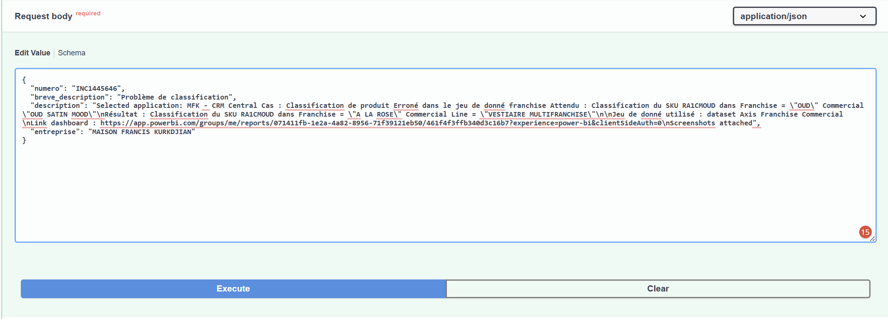
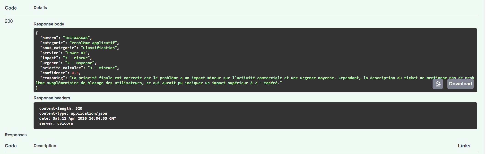
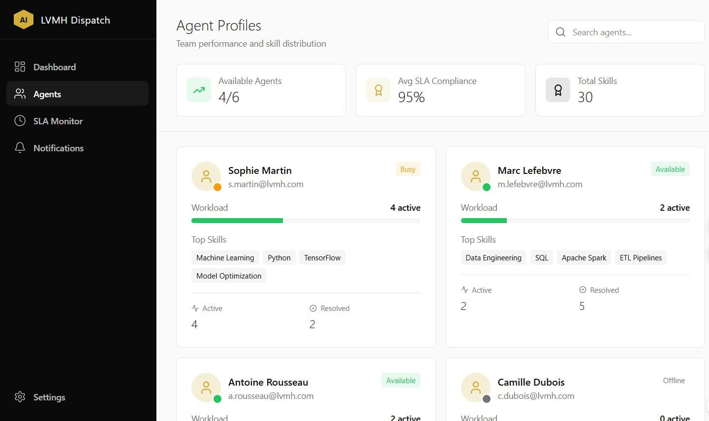
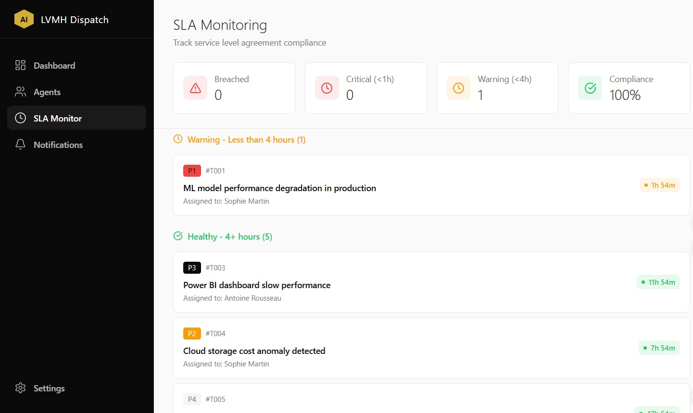

# AI Ticket Dispatch System (LVMH)

An intelligent, multi-agent system powered by **CrewAI** and **FastAPI** designed to automate ticket classification, priority calculation, and SLA monitoring with a premium React dashboard.

<video src="https://github.com/SemerNahdi/Ticket-Classifier-/raw/main/assets/Demo.mp4" controls width="100%"></video>

## 🌟 Key Features

- **AI Multi-Agent Pipeline**: Uses a triple-agent architecture (Analyst, Classifier, Validator) to ensure high-accuracy classification.
- **Interactive Dashboard**: A modern React-based Kanban board for managing tickets in real-time.
- **Agent Performance Tracking**: Monitor AI agent workloads, skills, and resolution rates.
- **SLA Monitoring**: Automatic identification of critical (P1) and warning-level tickets.
- **Persistence Layer**: All classifications are stored locally in `data/output/classifications_db.json` for history tracking.

## 📂 Project Structure

```text
Ticket Agent/
📂 assets/             # Project screenshots and media
📂 data/               # Input/Output data and persistent DB
📂 frontend/           # React (Vite) Frontend Application
📂 src/                # Core Logic
  📄 api.py            # FastAPI Backend with CORS & Persistence
  📂 agents/           # CrewAI Agent definitions
📂 tests/              # API and logic testing suite
📄 run_backend.py      # Entry point for Backend
📄 README.md           # Documentation
```

## 🚀 Setup & Running (Windows)

### 1. Backend Setup

1. Create and activate virtual environment:
   ```powershell
   python -m venv venv
   .\venv\Scripts\activate
   ```
2. Install dependencies:
   ```powershell
   pip install -r requirements.txt
   ```
3. Run the backend:
   ```powershell
   python run_backend.py
   ```
   _API Docs: http://localhost:8000/docs_

### 2. Frontend Setup

1. Open a new terminal in the `frontend` directory:
   ```powershell
   cd frontend
   npm install
   ```
2. Start the dashboard:
   ```powershell
   npm run dev
   ```
   _Dashboard Access: http://localhost:5173_

## 🛠️ AI System Architecture

The classification process involves three distinct agents:

1. **IT ServiceNow Analyst**: Extracts intent and identifies the core service.
2. **ITIL Classifier**: Assigns taxonomy labels and calculates priority using a matrix tool.
3. **Quality Auditor**: Validates the JSON structure and provides definitive reasoning.

|        API Input (Raw)         |     API Output (Classified)      |
| :----------------------------: | :------------------------------: |
|  |  |

## 📊 Modules Preview

|         Agent Profiles          |      SLA Monitoring       |
| :-----------------------------: | :-----------------------: |
|  |  |

---

_Developed for the EY Data Team - Module 1_
